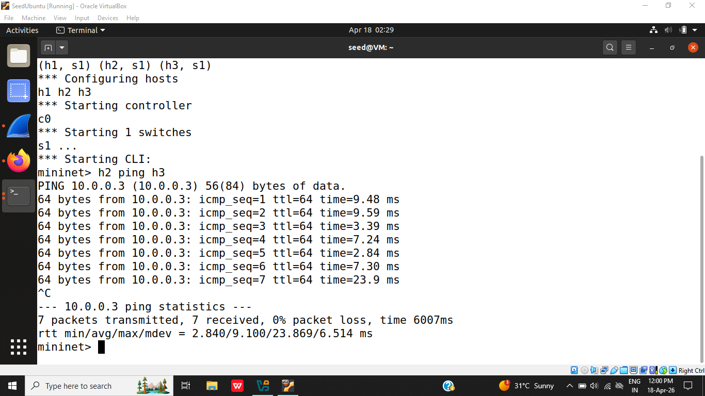
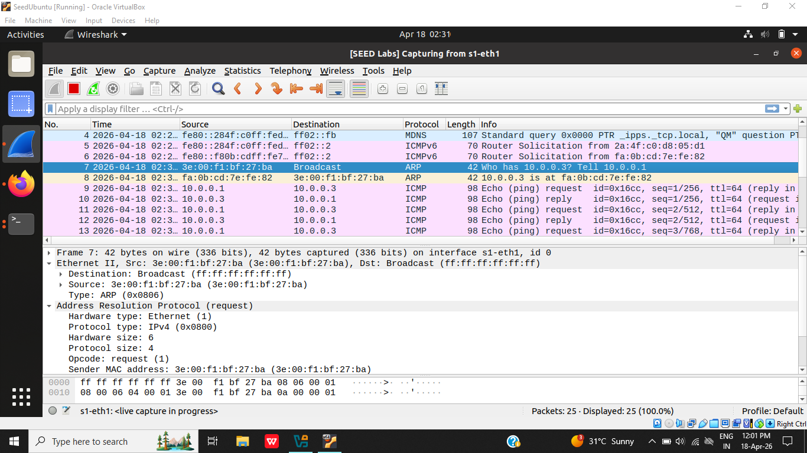
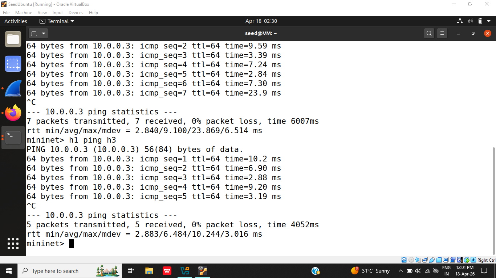
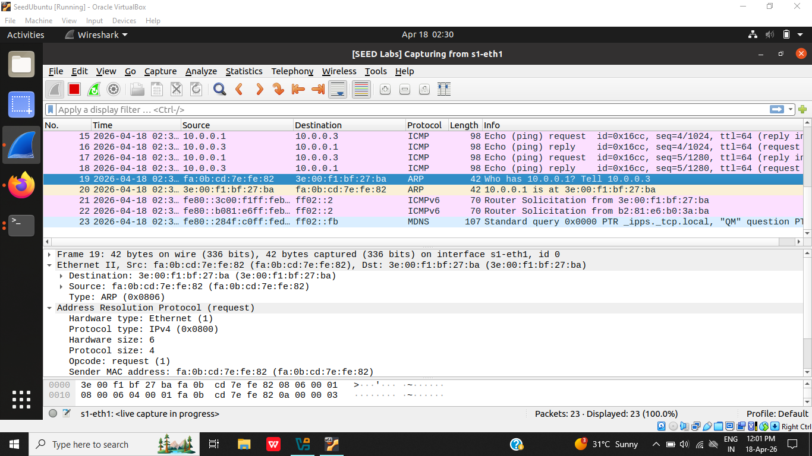
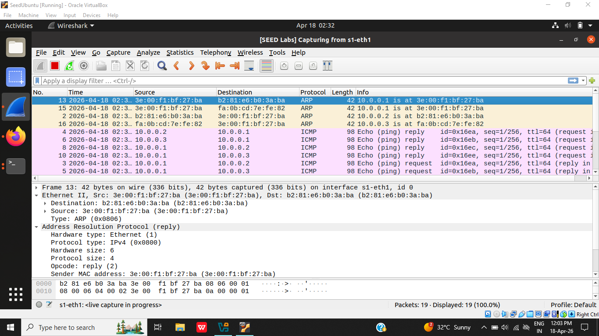
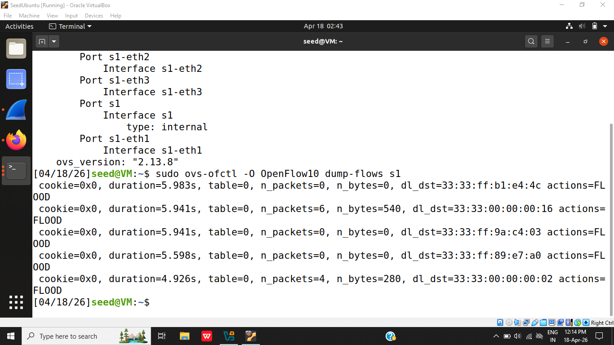
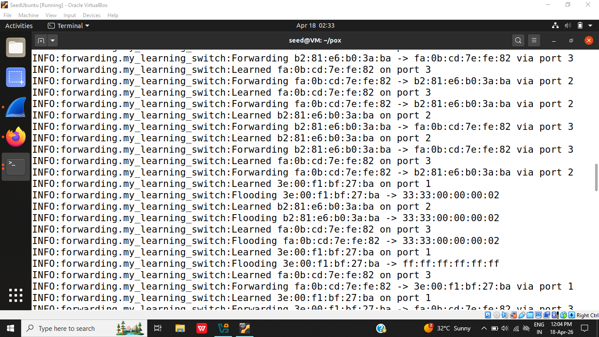
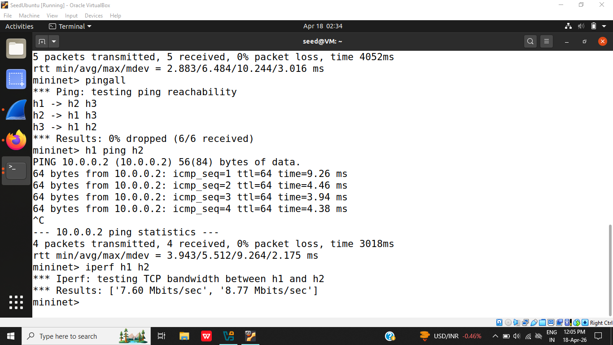
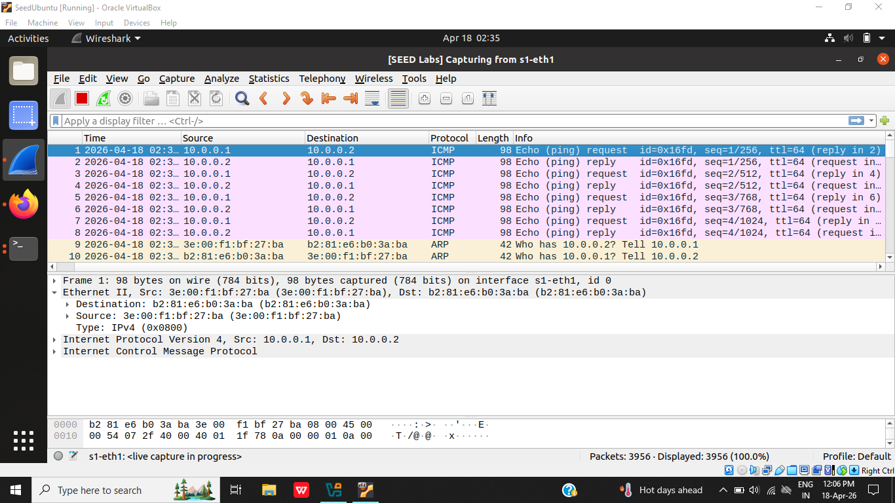

# SDN Learning Switch Controller with Firewall (POX + Mininet)

## Problem Statement
Implement a controller that mimics a learning switch by dynamically learning MAC addresses and installing forwarding rules.

## Features Implemented
- MAC Learning (Dynamic mapping of MAC → Port)
- Packet forwarding using learned entries
- Dynamic flow rule installation in switch
- Flow table inspection
- Firewall rule (block h1 → h3 traffic)

## Tools & Technologies
- Mininet (network simulation)
- POX Controller
- OpenFlow 1.0
- Python

## Network Topology
Single switch with 3 hosts:
- h1
- h2
- h3
 
## Setup & Execution Steps
  ### 1. Start POX Controller
  ```bash
  cd ~/pox
  ./pox.py log.level --DEBUG forwarding.my_learning_switch
  ```
  ### 2. Start Mininet 
  ```bash
  sudo mn -c
  sudo mn --topo single,3 --controller=remote --switch ovs,protocols=OpenFlow10
  ```
  ### 3. Test Scenarios
  Scenario 1: Normal Communication (All hosts can communicate when no restriction is applied)
  ```
  pingall
  h2 ping h3
  ```
  Scenario 2: Blocked Traffic (Traffic from h1 to h3 is blocked by controller logic)
  ``` h1 ping h3 ```
  Scenario 3: Latency Ping
  ``` h1 ping h2 ```
  Scenario 4: Throughput 
  ``` iperf h1 h2 ```

## Proof of Execution

### Allowed Traffic (h2 → h3) : Demonstrates normal communication between allowed hosts where packets are forwarded correctly.



### Blocked Traffic (h1 → h3) : The traffic from h1 to h3 is successfully blocked by the firewall rule implemented in the controller.



### Full Network Test (pingall) : Verifies overall connectivity of the network and correct forwarding behavior after MAC learning.


### Flow Table : Displays flow entries installed in the switch, confirming dynamic rule installation by the controller.


### Controller Logs : Shows MAC learning, flooding, forwarding decisions, and firewall blocking actions in real-time.


### Performance (Latency & Throughput) : Displays network performance metrics (latency (ping) and throughput (iperf)).




  
